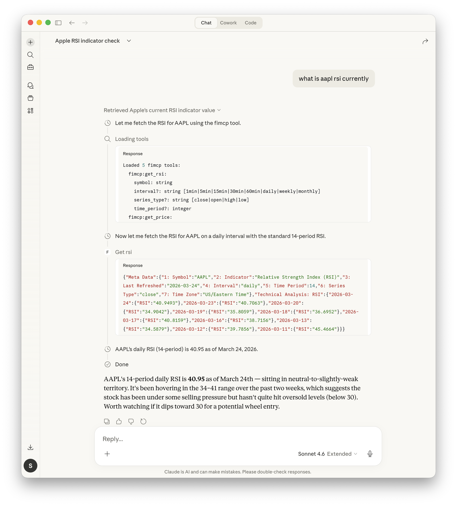

# fiMCP
A Model Context Protocol for stock market data using AlphaVantage API

## Instructions
* get AlphaVantage api key at https://www.alphavantage.co
* create a .env in the src directory and add the following
```ALPHA_VANTAGE_API_KEY=<YOUR_API_KEY>```

### Adding to Claude
* Locate the `claude_desktop_config.json` file. On MacOS it is typically located in `~/Library/Application Support/Claude/claude_desktop_config.json`

* Add the following to the JSON:
```json
{
  "mcpServers": {
    "MCP_DOCKER": {
      "command": "docker",
      "args": [
        "mcp",
        "gateway",
        "run"
      ]
    },
    "fimcp": {
      "command": "docker",
      "args": [
        "run",
        "-i",
        "--rm",
        "--init",
        "fimcp"
      ]
    }
  },
  ...
}
```
* Restart Claude and confirm it is added to the connectors in Claude Settings
* Query Claude for financial info




## Testing
>docker build -t fimcp .
docker run --env-file .env -it fimcp
docker run -d -p 8000:8000 --env-file .env fimcp

## Debugging
Follow logs in real time:
>tail -n 20 -F ~/Library/Logs/Claude/mcp*.log


## Indicators
The following indicators are currently available in addition to stock price:
* Relative Strength Index (RSI)
* Bollinger Bands (BBANDS)
* Simple Moving Average (SMA)
* Exponential Moving Average (EMA)

More indicators can be added based on what's supported by AlphaVantage APIs